# How to Use the Markdown Block Editor

## Basics of This Block Editor

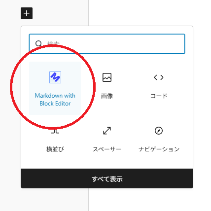

From the block editor list, find **Markdown with Block Editor** and add it.

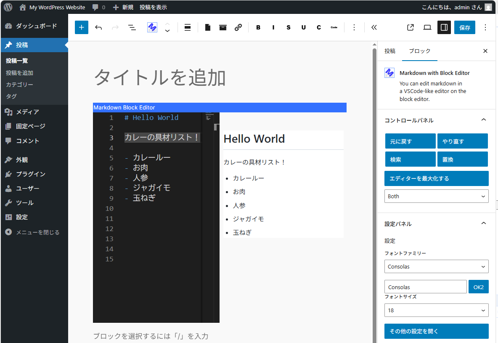

Enter Markdown in the VSCode-like editor on the left.
A live preview is shown on the right.

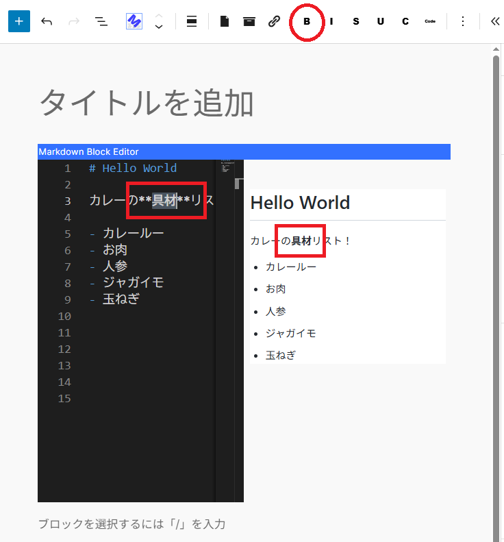

Select a string and click the **B** icon to make it bold.

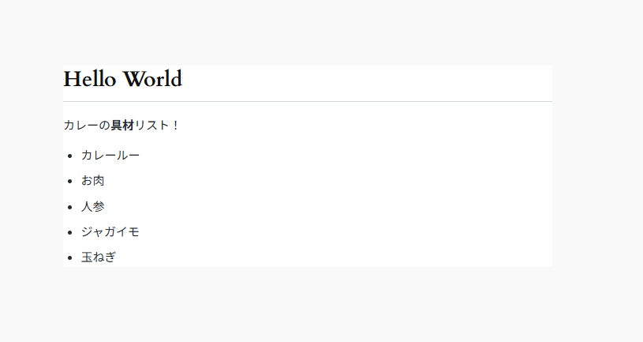

Save the content and check how it actually appears on the front-end page.

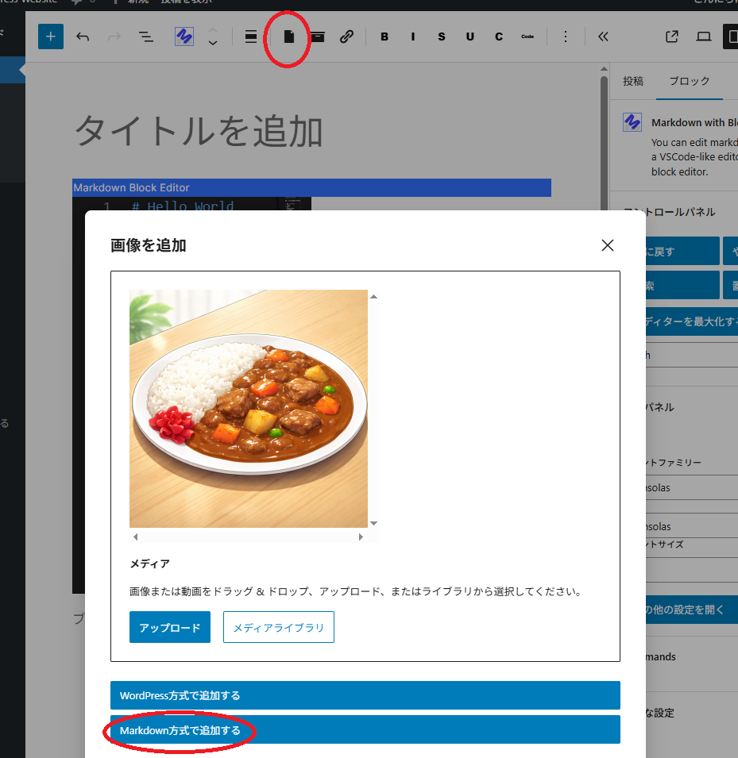

Next, let's add an image.

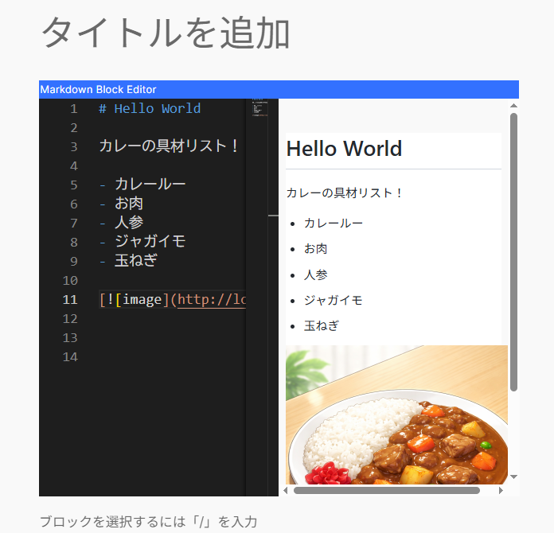

You can confirm the posted image in the preview.

## Slightly Advanced Features

Creating tables and writing source code is also easy.

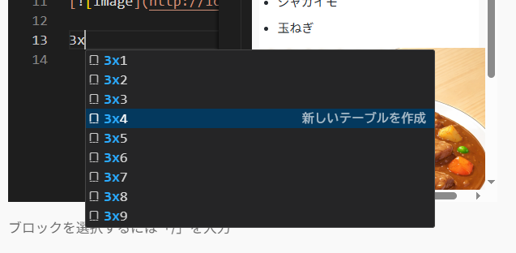

For example, if you type `3x` at the place where you want to add a table, IntelliSense will be triggered.
If you want to add a table with **3 columns and 4 rows**, select `3x4`.

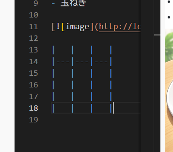

A table template will be created.

Let's turn the curry ingredients list from earlier into a table.

* As-is, one row is missing, so please add it.

Fill in the table.
Editing a table directly can be hard to read, but you can format the table.

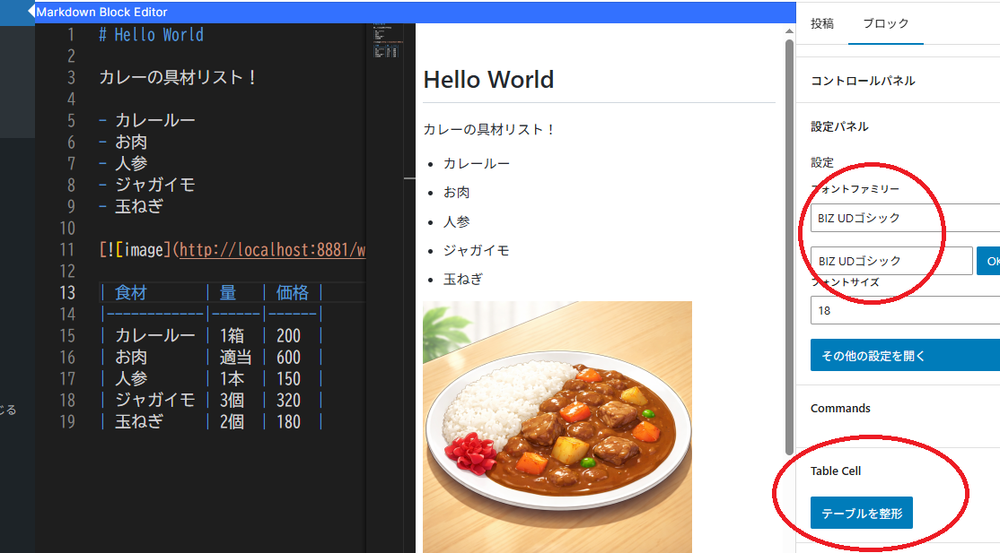

To display the format button, select a place that is not table text
(for example, the vertical bar `|`).
Clicking the button will format the table and make it look neat.

However, depending on the selected font, the layout may break.
This happens because the text is not using a monospaced font.

The available monospaced fonts vary depending on the OS, environment, and language.
Please adjust the appropriate font from the settings on the left.

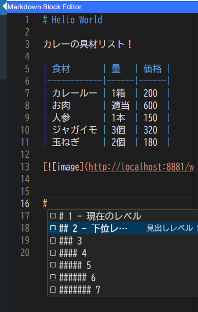

When you type `#`, you can use IntelliSense to add headings.

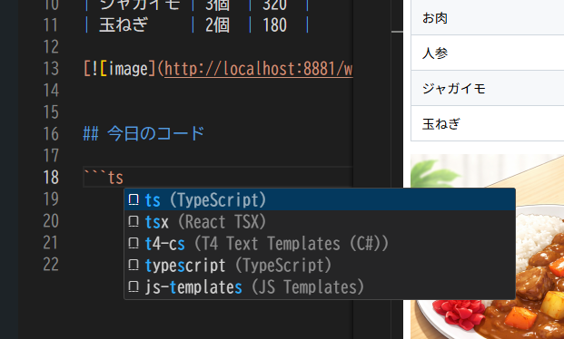

When you type backticks (`) or tildes (~), source code insertion assistance is available.

Prism.js is used for source code highlighting.

Once you've written this far, let's take a look at the front-end display.
